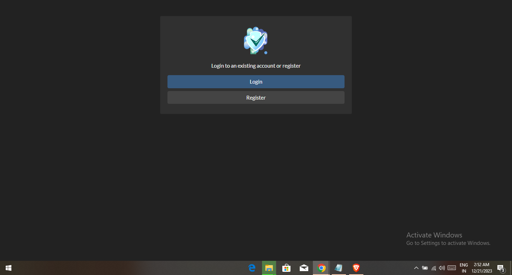
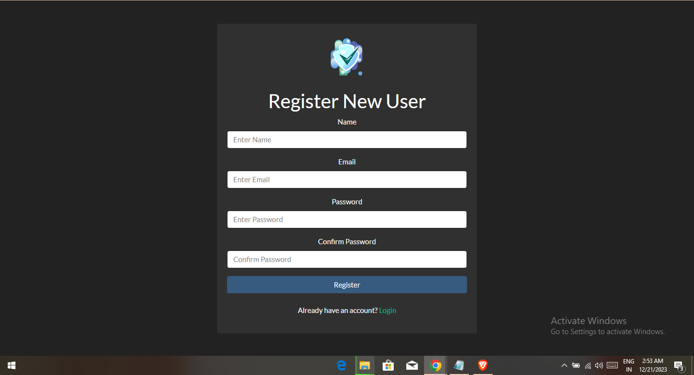
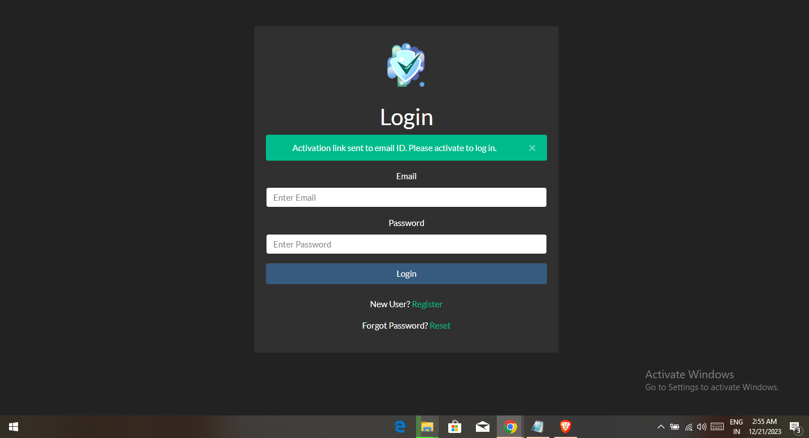
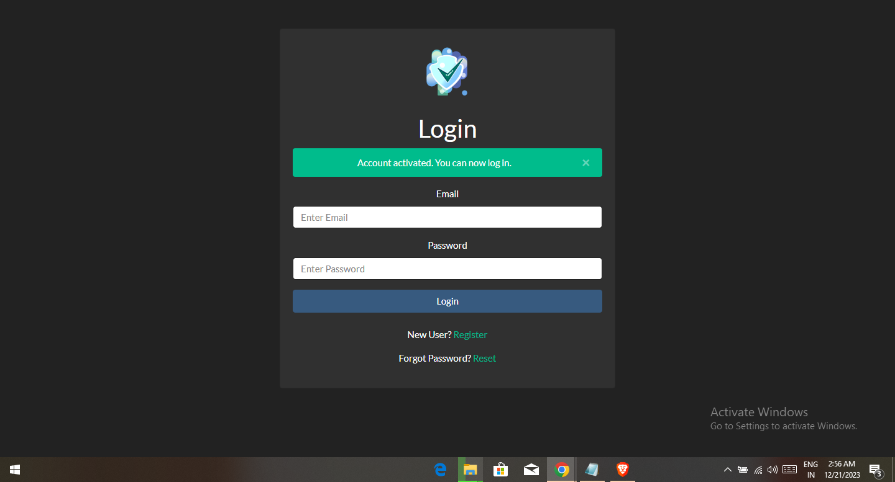
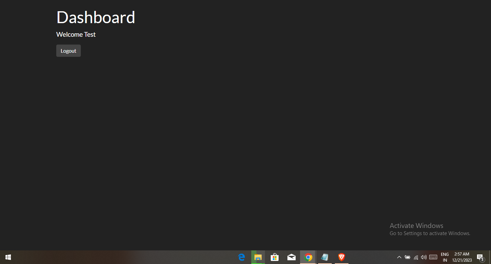
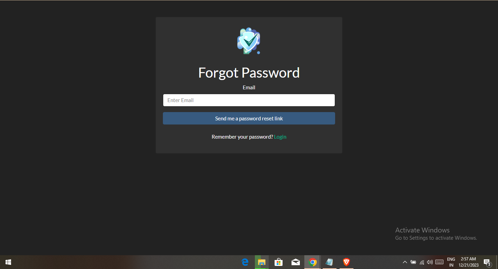

## <b>NodeJS Authentication App </b>
<h1 align="center">AUTHENTICATOR  🔐</h1> 

 A complete authenticator app with login, logout, register, forget password, email verification(for added security), and access control. Can be used as starter for other Node.JS applications. using Node.js, Express, Passport, JWT, Mongoose, and more. 

 
 Host link
 https://best-authantication-service.onrender.com

 

## Technologies Used
1.  NodeJS
2.  Express
3.  EJS
4.  MongoDB
5.  Mongoose
6.  PassportJS
7.  JWT
8.  Nodemailer

## Prerequisites
- Git
- NodeJS
- CLI
  
## <b>Screenshots 📷</b>

- Home Page
  

- Register User
  

- Activation Email
  

- Login Page
  

- Dashboard
  

- Forgot Password
  

-- Installation

-- Clone the latest Repository

`git clone https://github.com/diwakar-pugal/Authenticator`

-- Into the project directory

`cd nodejs-auth`

-- Installing NPM dependencies

`npm install`

-- Then simply start your app

`npm start`

-- The Server should now be running at http://localhost:7000/

- I Made it Mental ❤️ Thanks for believing !

